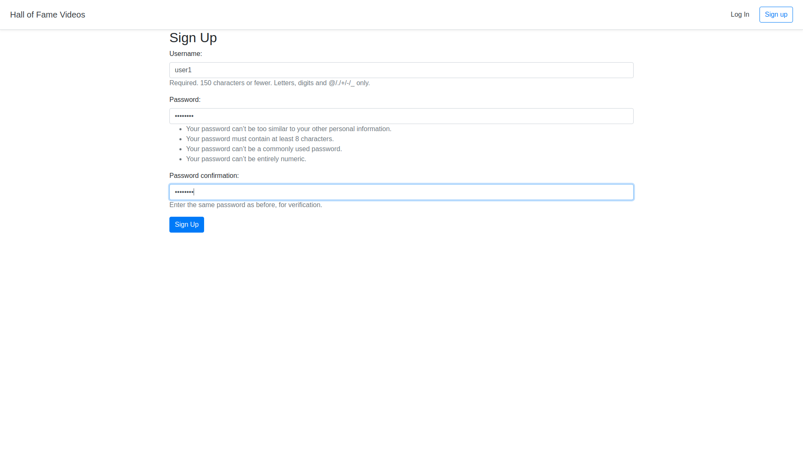
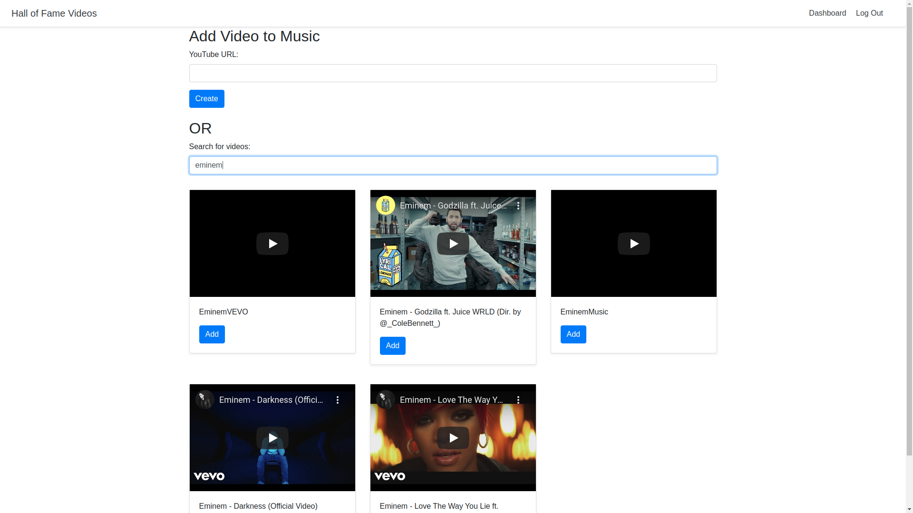
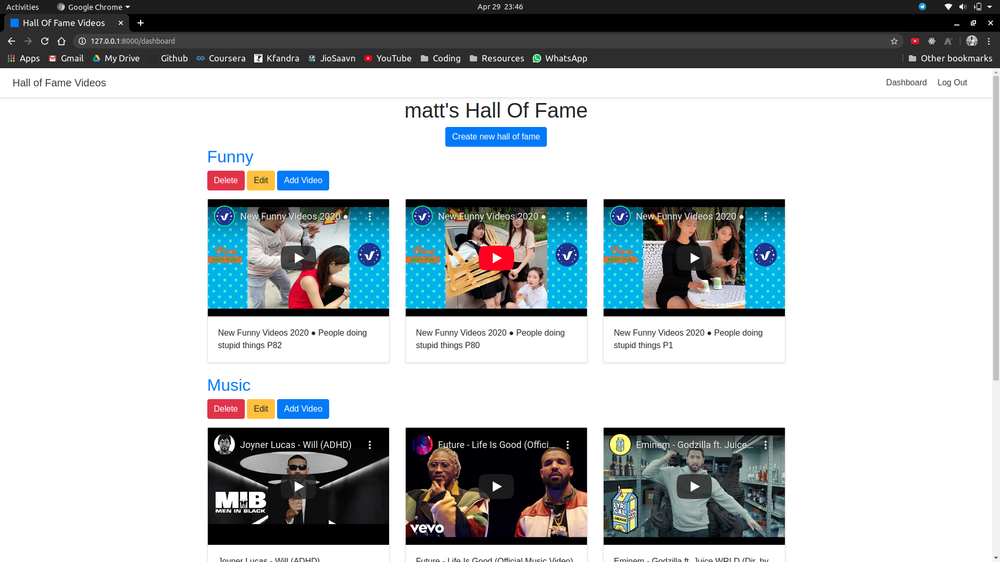

# Hall of Fame Videos

### Course by Nick Walter on Udemy

* #### Intermediate Django course with authentication, CRUD and permissions.
* #### Use of pipenv instead of virtualenv
* #### Use of YouTube API to get search results for videos using Ajax
* #### Deployable on heroku

### Steps to run the project:

* To install pip: **sudo apt install python3-pip**
* To install virtualenv: **sudo pip3 install virtualenv**
* To start virtualenv: **virtualenv venv**
* To activate virtualenv: **source venv/bin/activate**
* To deactivate virtualenv: **deactivate**
* To install requirements and run project: 
    1. Activate virtualenv
    2. To install dependencies required **pip3 install -r requirements.txt**
    3. Run **python manage.py makemigrations**
    4. Run **python manage.py migrate** to make migrations
    5. Add a few queries in the database to see functioning
    6. To run **python manage.py runserver**
    
### Snippets of the project: 

  
  
  
  
  
 

